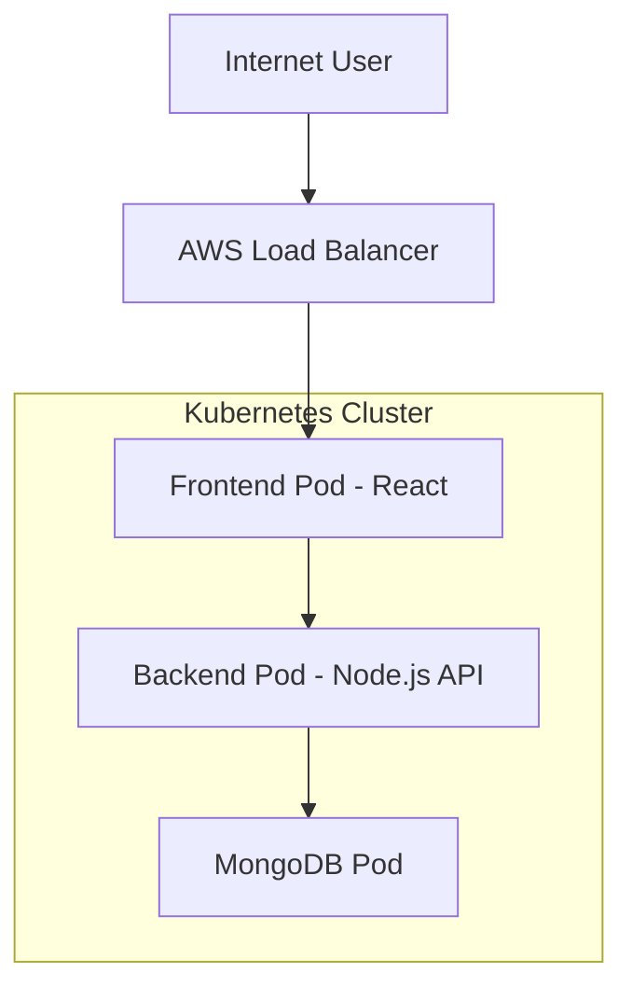

# DevOps Project Report: Three-Tier Application Deployment on AWS EKS using Terraform

**Author:** Parker  
**Project:** three-tier-eks-iac  
**Environment:** AWS • Kubernetes • Docker • Terraform  
**Date:** 2026  

---

# Table of Contents

1. [Project Overview](#1-project-overview)  
2. [Architecture Diagram](#2-architecture-diagram)  
3. [Prerequisites & Tool Installation](#3-prerequisites--tool-installation)  
4. [Infrastructure Provisioning using Terraform](#4-infrastructure-provisioning-using-terraform)  
5. [EKS Cluster Access Configuration](#5-eks-cluster-access-configuration)  
6. [Docker Image Build & Push](#6-docker-image-build--push)  
7. [Kubernetes Namespace Setup](#7-kubernetes-namespace-setup)  
8. [MongoDB Database Deployment](#8-mongodb-database-deployment)  
9. [Backend API Deployment](#9-backend-api-deployment)  
10. [Frontend Deployment](#10-frontend-deployment)  
11. [Load Balancer Exposure](#11-load-balancer-exposure)  
12. [Monitoring & Observability](#12-monitoring--observability)  
13. [Challenges Faced & Fixes](#13-challenges-faced--fixes)  
14. [Key Learnings](#14-key-learnings)  
15. [Conclusion](#15-conclusion)  

---

# 1. Project Overview

This project demonstrates end-to-end deployment of a containerized three-tier web application on Amazon EKS using Terraform Infrastructure-as-Code.

The deployment automates:

• AWS networking  
• EKS cluster provisioning  
• Node group creation  
• Load balancer setup  
• Monitoring stack deployment  

Application architecture:

• Frontend → React  
• Backend → Node.js API  
• Database → MongoDB  

All components are containerized and orchestrated using Kubernetes.

---

# 2. Architecture Diagram



---

# 3. Prerequisites & Tool Installation

## Install kubectl

https://kubernetes.io/docs/tasks/tools/

```bash
kubectl version --client
```

---

## Install Helm

https://helm.sh/docs/intro/install/

```bash
helm repo update
```

---

## Install AWS CLI v2

https://aws.amazon.com/cli/

```bash
aws --version
```

---

# 4. Infrastructure Provisioning using Terraform

```bash
cd terraform

terraform init
terraform plan
terraform apply -auto-approve
```

---

# 5. EKS Cluster Access Configuration

```bash
aws eks update-kubeconfig \
  --name my-eks-cluster \
  --region us-west-2
```

Verify:

```bash
kubectl auth can-i "*" "*"
kubectl get nodes
```

---

# 6. Docker Image Build & Push

```bash
aws ecr-public get-login-password --region us-east-1 \
| docker login --username AWS \
--password-stdin public.ecr.aws/w8u5e4v2
```

---

# 7. Kubernetes Namespace Setup

```bash
kubectl create ns workshop
kubectl config set-context --current --namespace workshop
```

---

# 8. MongoDB Database Deployment

```bash
cd k8s_manifests/mongo_v1

kubectl apply -f secrets.yaml
kubectl apply -f deploy.yaml
kubectl apply -f service.yaml
```

---

# 9. Backend API Deployment

```bash
kubectl apply -f backend-deployment.yaml
kubectl apply -f backend-service.yaml
```

---

# 10. Frontend Deployment

```bash
kubectl apply -f frontend-deployment.yaml
kubectl apply -f frontend-service.yaml
```

---

# 11. Load Balancer Exposure

```bash
kubectl apply -f full_stack_lb.yaml
kubectl get svc
```

---

# 12. Monitoring & Observability

Grafana Credentials:

```
Username: admin
Password: prom-operator
```

Dashboard ID:

```
1860
```

---

# 13. Challenges Faced & Fixes

### EKS Access Denied

```bash
aws eks update-kubeconfig \
--name my-eks-cluster \
--region us-west-2
```

### Pods Pending

Enabled Cluster Autoscaler.

### LoadBalancer Pending

Installed AWS Load Balancer Controller.

### ImagePullBackOff

Rebuilt and pushed images.

---

# 14. Key Learnings

```
• Terraform automates infrastructure
• Kubernetes orchestrates containers
• IAM roles are critical
• Load balancers expose services
• Monitoring ensures reliability
```

---

# 15. Conclusion

This project automated deployment of a scalable three-tier application on AWS EKS using Terraform and Kubernetes, demonstrating production-grade DevOps practices.

---
